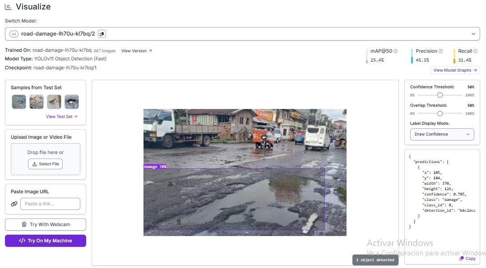
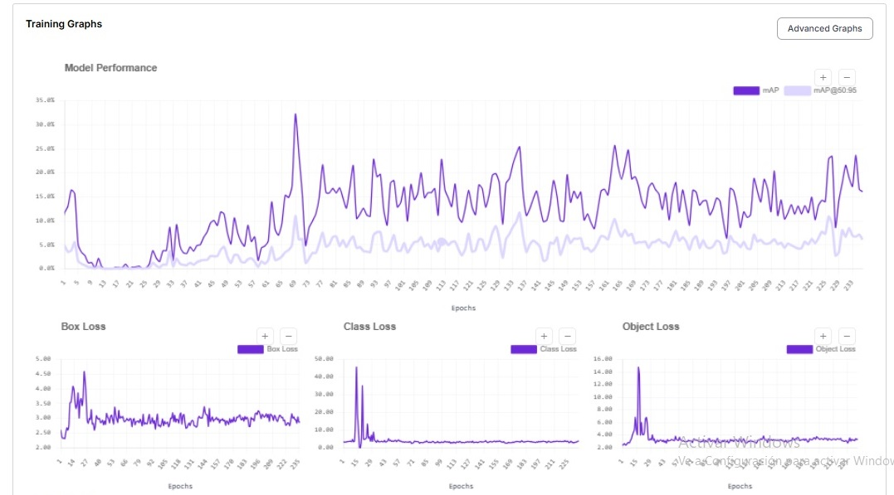
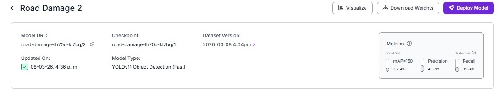
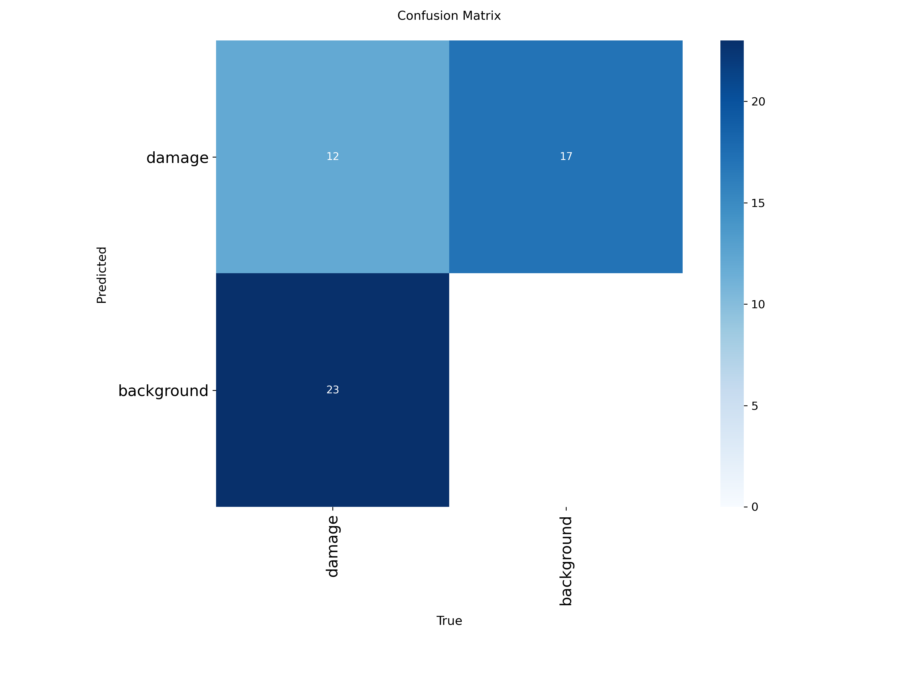
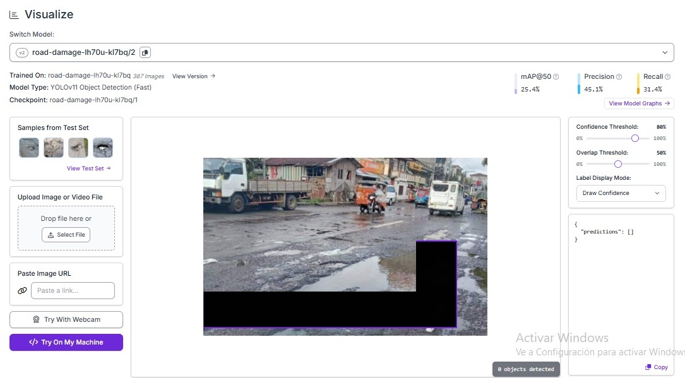

# Detección automática de daños en pavimentos con YOLO

## 1. Introducción

El deterioro de pavimentos urbanos representa uno de los principales desafíos para la gestión de infraestructura vial. Problemas como grietas, baches y deformaciones del asfalto afectan la seguridad vial, aumentan los costos de mantenimiento y reducen la vida útil de la infraestructura.

Actualmente, muchas inspecciones de pavimentos se realizan mediante evaluaciones visuales manuales realizadas por técnicos en terreno. Este proceso puede ser lento, costoso y susceptible a variaciones en los criterios de evaluación.

En este contexto, la **visión por computador** y el **aprendizaje profundo** permiten desarrollar sistemas automatizados capaces de detectar daños en pavimentos a partir de imágenes.

Este proyecto desarrolla un **prototipo de detección automática de daños en pavimentos utilizando YOLO**, aplicado a imágenes de carreteras y vías urbanas.

---

# 2. Problema AECO

El proyecto aborda un problema dentro del sector **AECO (Architecture, Engineering, Construction & Operations)**.

## Problema

Identificar automáticamente daños visibles en pavimentos mediante análisis de imágenes utilizando modelos de visión computacional.

## Contexto

La detección temprana de deterioro en carreteras permite mejorar la planificación de mantenimiento, optimizar recursos y aumentar la seguridad vial.

## Usuarios potenciales

- Municipios
- Departamentos de infraestructura
- Empresas de mantenimiento vial
- Concesionarias de carreteras

---

# 3. Criterios de éxito del modelo

El modelo se considera exitoso si logra:

- Detectar automáticamente regiones deterioradas del pavimento mediante bounding boxes.
- Obtener métricas de desempeño aceptables para un prototipo inicial.
- Demostrar la viabilidad del uso de modelos de visión por computador en inspección vial.
- Generar un flujo reproducible de entrenamiento utilizando Google Colab.

---

# 4. Clases del modelo y reglas de etiquetado

El modelo fue entrenado utilizando una única clase:

**Clase**

- `damage`

Esta clase agrupa distintos tipos de deterioro en pavimentos, incluyendo:

- grietas longitudinales
- grietas transversales
- baches
- desprendimiento del pavimento
- deformaciones del asfalto

### Reglas de etiquetado

Para garantizar consistencia en el dataset se aplicaron las siguientes reglas:

- Cada región visible de deterioro se etiqueta con un **bounding box**.
- Se etiquetan únicamente daños presentes en la superficie del pavimento.
- No se etiquetan sombras, agua o elementos externos al pavimento.
- El bounding box debe cubrir la mayor parte del daño visible.

---

# 5. Dataset

El dataset fue gestionado mediante **Roboflow**.

Características principales:

- Número total de imágenes: **387**
- Tipo de anotación: **Bounding Boxes**
- Número de clases: **1**

### División del dataset

- Entrenamiento: **80%**
- Validación: **10%**
- Test: **10%**

---

# 6. Notebook del proyecto (Google Colab)

El experimento completo puede reproducirse utilizando el notebook desarrollado en Google Colab.

Abrir el notebook aquí:

https://colab.research.google.com/drive/1OCBbkK5JakNyP9pZA2OA23eiB14yKi6W?usp=sharing

El notebook incluye:

- descarga del dataset
- configuración del entorno
- entrenamiento del modelo YOLO
- evaluación del modelo
- generación de resultados y visualizaciones

---

# 7. Entrenamiento del modelo

El modelo fue entrenado utilizando **YOLOv8**.

Configuración principal:

- Modelo: **YOLOv8n**
- Tamaño de imagen: **640 × 640**
- Epochs: **30**
- Batch size: **16**
- Entorno: **Google Colab GPU (Tesla T4)**

---

# 8. Resultados del entrenamiento

Los gráficos de entrenamiento muestran la evolución de las funciones de pérdida y métricas del modelo.

---

# 9. Métricas del modelo

Las métricas obtenidas fueron:

- **mAP@50:** 25.4%
- **Precision:** 45.1%
- **Recall:** 31.4%

---

# 10. Matriz de confusión

La matriz de confusión permite analizar el comportamiento del modelo.

---

# 11. Ejemplos de detección

### Ejemplo 1

### Ejemplo 2

### Ejemplo 3

---

# 12. Análisis del umbral de confianza

### Umbral 70%

### Umbral 80%

---

# 13. Checklist de reproducibilidad

**Dataset**

- Plataforma: Roboflow

**Split**

- Train: 80%
- Validation: 10%
- Test: 10%

**Modelo**

- YOLOv8n

**Parámetros de entrenamiento**

- Epochs: 30
- Batch size: 16
- Image size: 640

**Framework**

- Ultralytics YOLOv8
- Python
- Google Colab

---

# 14. Gobernanza y consideraciones éticas

Este proyecto incluye un análisis de gobernanza y riesgos asociados al uso de modelos de visión computacional.

Para más detalles ver:

[Checklist de gobernanza del proyecto](docs/governance_checklist.md)

---

# 15. Conclusión

Este proyecto demuestra la viabilidad de utilizar **modelos de detección de objetos basados en aprendizaje profundo para identificar daños en pavimentos**.

Aunque se trata de un prototipo inicial, los resultados muestran el potencial de estas tecnologías para soportar sistemas de inspección automatizada en infraestructura vial dentro del sector AECO.

El desarrollo futuro de datasets más amplios y modelos más robustos podría permitir implementar soluciones reales para el monitoreo inteligente de carreteras.

---

# Tecnologías utilizadas

- Python  
- YOLOv8 (Ultralytics)  
- Roboflow  
- Google Colab  
- Visión por computador  
- Aprendizaje profundo
  ## Material complementario

### Mini-informe del proyecto
[Ver informe en PDF](docs/Mini_informe_yolo.pdf)
